# Autotuning PostgreSQL: Frontend

## Sumário

- [Papel deste repositório](#papel-deste-repositório)
- [Participantes](#participantes)
- [Tecnologias](#tecnologias)
- [Arquitetura: visão geral](#arquitetura-visão-geral)
- [Por que as 6 abas ficam sempre montadas](#por-que-as-6-abas-ficam-sempre-montadas)
- [A máquina de estados do fluxo de trabalho](#a-máquina-de-estados-do-fluxo-de-trabalho)
- [Como o terminal em tempo real funciona](#como-o-terminal-em-tempo-real-funciona)
- [Camada de dados](#camada-de-dados)
- [Resultados e validação](#resultados-e-validação)
- [Limitações](#limitações)
- [Estrutura do Projeto](#estrutura-do-projeto)
- [Requisitos](#requisitos)
- [Como Executar](#como-executar)

## Papel deste repositório

Interface web (React + TypeScript) pra acompanhar e controlar a coleta de
benchmark do projeto de autotuning PostgreSQL, consumindo a API do
repositório irmão [`Autotuning-PostgreSQL-Backend`](../Autotuning-PostgreSQL-Backend)
(Java + Spring Boot), que por sua vez orquestra o
[`Autotuning-PostgreSQL-Pipeline`](../Autotuning-PostgreSQL-Pipeline)
(Python, responsável pela geração das configurações via Latin Hypercube Sampling, execução
real dos benchmarks TPC-H/TPC-DS e treino do meta-modelo de ML).

É a reescrita em React + TypeScript de um frontend original em JavaScript
puro (ver `git log`: o commit `623ed9b` é a importação do frontend estático
original, extraído de templates Jinja + arquivos estáticos servidos pelo
backend Python). A reescrita foi decisão minha de stack, não motivada
por limitação técnica da versão anterior, e reaproveita deliberadamente
vários comportamentos exatos do app vanilla (polling nunca gated pela aba
ativa, mesmo backoff de reconexão do terminal, mesmo evento `reset`), como
os comentários no código deixam explícito.

6 abas, sempre montadas simultaneamente (visibilidade alternada só por
classe CSS, nunca desmontagem condicional), pra não derrubar as 3 conexões
SSE de terminal nem recriar os gráficos de hardware ao trocar de aba:

- **Início** (`workflow`): máquina de estados do fluxo de trabalho (gerar
  → preparar imagens Docker → rodar fila de benchmarks → ver resultados),
  com transição automática entre etapas e navegação automática pro
  terminal certo quando um processo começa/termina.
- **Fila** (`queue`): tarefas de benchmark pendentes/rodando/concluídas,
  com filtro por status (`pending`/`running`/`done`/`abandoned`).
- **Configurações** (`configs`): todas as combinações de parâmetros
  PostgreSQL geradas por Latin Hypercube Sampling, com filtro por tier,
  combinação e busca textual, e expansão de detalhe por linha.
- **Hardware** (`hardware`): métricas em tempo real (CPU%, frequência,
  temperatura por sensor, RAM, disco) via polling de 1s, com gráficos de
  linha (janela de 30 amostras) e grid de sensores usando IDs estáveis
  expostos pelo backend (`ServerInfo.sensors`).
- **Terminal** (`terminal`): 3 streams de log em tempo real (gerador,
  preparo de imagens, runner), via Server-Sent Events + `@xterm/xterm`.
- **Resultados** (`results`): lista de tarefas concluídas com detalhe
  (gráfico de barras `exec_ms` por query TPC-H/TPC-DS, configuração
  PostgreSQL usada, resumo de hardware durante a execução da tarefa).

As abas **Fila**, **Configurações** e **Resultados** só aparecem na
navegação quando há dado pra mostrar (`showQueueConfigs` = existe alguma
tarefa na fila; `showResults` = existe alguma tarefa `done`, ver
`NavTabs.tsx`), mas continuam montadas em `App.tsx` mesmo escondidas da
navegação.

## Participantes

| Nome | Matricula |
|---|---|
| Gustavo Vieira de Araujo | 211068440 |

## Tecnologias

| Tecnologia | Uso |
|---|---|
| Vite | Build tool e dev server |
| React 19 | Biblioteca de UI |
| TypeScript | Tipagem estática |
| Tailwind CSS v4 | Estilização |
| `@tanstack/react-query` | Polling e cache das chamadas REST ao Backend |
| `@xterm/xterm` + `@xterm/addon-fit` | Terminais em tempo real via SSE |
| `chart.js` + `react-chartjs-2` | Gráficos de hardware e resultados |
| oxlint | Linter |

## Arquitetura: visão geral



As 3 queries de polling (fila, status combinado, métricas de hardware)
vivem no componente raiz `App.tsx`, não dentro de cada painel. Assim elas
continuam rodando (e o hook de máquina de estados continua reagindo)
independente de qual aba está visível, replicando o comportamento do app
original onde os `setInterval` nunca eram condicionados à aba ativa.

## Por que as 6 abas ficam sempre montadas

A decisão mais estrutural do código é esta, em `App.tsx`:

```tsx
{/* Todas as abas ficam sempre montadas, so a visibilidade alterna via
    classe CSS. Renderizacao condicional desmontaria as 3 conexoes SSE
    do terminal e os graficos de hardware a cada troca de aba. */}
<main className="main-content">
  <div className={`pane ${activeTab !== 'workflow' ? 'hidden' : ''}`}>
    <WorkflowPane ... />
  </div>
  ...
</main>
```

**A forma ingênua** de implementar navegação por abas em React seria
renderização condicional: `{activeTab === 'terminal' && <TerminalPane />}`.
É o padrão mais comum porque é o mais simples: só existe uma árvore de
componentes montada por vez, o resto some do DOM.

O problema é que aqui isso quebraria três coisas ao mesmo tempo:

1. **As 3 conexões SSE do terminal cairiam.** `TerminalPane` cria os 3
   `EventSource` (generate/prepare/runner) via `useTerminalStream` assim
   que monta (ver seção seguinte). Se o componente fosse desmontado ao
   trocar de aba, o `cleanup` do `useEffect` fecharia essas conexões
   (`sseRef.current?.close()`), perdendo o histórico acumulado no buffer do
   xterm (`scrollback: 50000`) e forçando reconexão do zero, inclusive
   perdendo log de um processo que pode levar 30–90 minutos (preparo de
   imagens Docker) enquanto o usuário está olhando outra aba.
2. **Os gráficos de hardware seriam recriados a cada troca de aba.**
   `HardwarePane` mantém um estado local (`cpuData`, `tempData`, `labels`)
   que acumula uma janela deslizante de 30 amostras a 1 leitura/segundo.
   Desmontar o componente zeraria esse buffer: o gráfico "Último Minuto"
   voltaria a ficar vazio toda vez que o usuário saísse e voltasse pra aba
   Hardware, mesmo que o polling de `/api/metrics` nunca tenha parado.
3. O comportamento deixaria de bater com o app vanilla original, que nunca
   condicionava os `setInterval`/`EventSource` à visibilidade de nenhuma
   seção da página.

**A forma real**, portanto, é: as 6 `<div className="pane">` sempre
existem no DOM; só a classe `hidden` (`display: none`, definida em
`src/index.css`) alterna. Isso mantém toda a árvore React montada e viva:
os hooks continuam rodando, os `EventSource` continuam abertos, o estado
local de cada painel é preservado, e o custo é puramente de CSS, não de
lógica.

## A máquina de estados do fluxo de trabalho

A aba Início não decide o que mostrar com um único pedaço de estado: ela
combina **dois níveis** de informação, implementados em
`src/state/workflow/`:

### 1. O passo persistido (`WorkflowStep`)

Um valor discreto (`'idle' | 'generated' | 'prepared' | 'ran'`), mantido
em `useReducer` (`workflowReducer.ts`) e persistido em
`localStorage` (chave `pga_step`, via `loadPersistedStep`/`persistStep`).
Ele sobrevive a reload de página e representa "onde o usuário chegou no
fluxo", não "o que está acontecendo agora".

O reducer consolida, segundo o próprio comentário do código-fonte, "as
duas heurísticas ad-hoc do app vanilla original (`inferStepFromTasks`, que
só olhava o conteúdo da fila, e a comparação prev/new dos booleanos de
processo dentro de `fetchStatus`)" numa única fonte de verdade. As
transições:

- `TASKS_UPDATED`: sem tarefas → `idle`; alguma tarefa `done` → `ran`; se
  ainda `idle` e já existem tarefas → `generated`.
- `GENERATOR_FINISHED`: força `generated` (disparado quando o processo de
  geração passa de rodando para parado).
- `PREPARE_FINISHED`: só promove `generated → prepared` (não mexe se já
  estiver em outro passo).
- `PROMOTE_TO_PREPARED_IF_READY`: cobre reload de página depois que o
  preparo já terminou sem o app ter visto a transição rodando→parado (ex:
  preparo rodou e terminou com a aba fechada). Se `step === 'generated'`,
  `prepareRunning === false`, `imagesReady === true` e há tarefas, promove
  pra `prepared`.

### 2. O modo de exibição derivado (`DisplayMode`)

Um segundo valor (`'idle' | 'generating' | 'generated' | 'preparing' |
'prepared' | 'running' | 'ran'`, 7 modos, três a mais que os 4 passos
persistidos), calculado a cada render por `deriveDisplayMode`, uma função
pura sem estado próprio que sobrepõe **sinais ao vivo** dos 3 processos
(`generatorRunning`, `prepareRunning`, `runnerRunning`, vindos do polling
de `/api/*/status` a cada 3s) sobre o passo persistido:

```ts
export function deriveDisplayMode(step: WorkflowStep, live: LiveProcessFlags): DisplayMode {
  if (live.runnerRunning) return 'running';
  if (live.generatorRunning) return 'generating';
  if (live.prepareRunning) return 'preparing';
  return step;
}
```

A prioridade é fixa: `running > generating > preparing > (passo
persistido)`. É esse `DisplayMode`, não o `WorkflowStep`, que o
`WorkflowPane` de fato usa para escolher qual card do "hero" desenhar.

`useWorkflowState.ts` é quem liga as duas pontas: reage à fila
(`TASKS_UPDATED`) e às transições de status dos 3 processos comparando o
valor anterior com o novo (`prevFlags` num `useRef`), disparando as ações
do reducer e, em paralelo, navegação automática pro sub-terminal certo
(`onAutoNavigate`) sempre que um processo começa ou termina, inclusive
disparando `usePrepareStart` automaticamente quando o gerador termina.



## Como o terminal em tempo real funciona

O hook `src/hooks/useTerminalStream.ts` é uma porta declarada no próprio
código como equivalente ao `terminal.js` do app vanilla original: "mesmo
decode base64→bytes, mesmo backoff linear de reconexão, mesmo evento
customizado `reset`". Cada uma das 3 chamadas (`generate`/`prepare`/`runner`,
uma por sub-aba do Terminal) monta sua própria instância de
`@xterm/xterm` + `FitAddon` e sua própria conexão `EventSource`.

**Conexão e decodificação.** `connect()` abre
`new EventSource(`${API_BASE}/stream/${key}`)`. Cada mensagem
(`sse.onmessage`) chega como uma string base64 (`e.data`); o hook faz
`atob()` e converte manualmente char a char pra `Uint8Array`, escrevendo os
bytes crus direto no terminal via `term.write(bytes)`, preservando
sequências de escape ANSI (cores, etc.) exatamente como o processo do
backend as produziu.

**Evento `reset`.** Além do stream de dados padrão, o backend também
emite um evento nomeado `reset` (`sse.addEventListener('reset', ...)`),
usado para sinalizar que o arquivo de log foi truncado por uma nova
execução do processo. O hook responde limpando o terminal
(`term.clear()`) e zerando a flag `hasContentRef`, que por sua vez controla
se a mensagem de "aguardando..." (`IDLE_MESSAGES`) deve ser reexibida.

**Reconexão.** `sse.onerror` fecha a conexão morta, incrementa um contador
de tentativas (`retriesRef`) e agenda uma nova chamada a `connect()` com
backoff linear limitado: `Math.min(3000 * retriesRef.current, 15000)` ms
(3s, 6s, 9s, ... até um teto de 15s). O estado de conexão exposto pro botão
"Reconectar" da UI (`connecting`/`connected`/`disconnected`) vem de um
`useState` próprio (`connectionState`).

O detalhe mais sutil do hook é **`connectRef`**. A função `connect()` é
declarada dentro do `useEffect` de montagem. Ali dentro ela tem acesso
direto ao `term`, ao `container` e às funções auxiliares (`writeData`,
`showIdle`) daquela instância específica de terminal, todos por closure.
Só que a função `reconnect()` que o hook expõe pro componente (usada no
botão "Reconectar" da `TerminalPane`) é definida **fora** desse
`useEffect`, no retorno do hook. Ela não tem, e não pode ter, acesso
direto a essa `connect()` sem passar por uma referência guardada em algum
lugar estável entre renders. Por isso o hook faz:

```ts
connectRef.current = connect;
connect();
...
reconnect: () => {
  sseRef.current?.close();
  retriesRef.current = 0;
  termRef.current?.clear();
  hasContentRef.current = false;
  if (reconnectTimerRef.current !== null) window.clearTimeout(reconnectTimerRef.current);
  connectRef.current?.();
},
```

O motivo de existir esse `connectRef` (em vez de, por exemplo,
`reconnect()` simplesmente instanciar um novo `EventSource` diretamente)
é evitar duplicar a lógica de conexão em dois lugares. Se `reconnect()`
criasse seu próprio `new EventSource(...)` do zero, seria fácil esquecer
de religar algum dos handlers (`onopen`, `onmessage`, `addEventListener('reset', ...)`,
`onerror`) que a `connect()` original já registra, produzindo uma conexão
"morta": o `EventSource` abre normalmente, mas fica sem escrever dados no
terminal ou sem detectar erro pra tentar reconectar de novo. Guardar a
própria função `connect` (o closure real, com todos os handlers) em
`connectRef.current` garante que tanto a reconexão automática
(`sse.onerror` chamando `connect` diretamente, já que está no mesmo
escopo) quanto a reconexão manual (`reconnect()`, de fora do efeito)
disparam exatamente a mesma lógica completa, nunca uma versão
parcialmente reimplementada.

## Camada de dados

Toda a comunicação com o backend passa por `src/api/client.ts` (um
`fetch` fino com `ApiError` tipado) e `src/api/queries.ts`
(`@tanstack/react-query`). Três hooks de polling rodam continuamente a
partir de `App.tsx`, cada um com uma frequência diferente, definida em
`queries.ts`:

| Hook | Endpoint(s) | Intervalo | Por quê |
|---|---|---|---|
| `useQueueQuery` | `GET /api/queue` | 3s | A fila muda por tarefa concluída/iniciada: granularidade de segundos é suficiente pra acompanhar progresso sem gerar tráfego desnecessário. |
| `useProcessStatusQuery` | `GET /api/generator/status`, `/api/prepare/status`, `/api/runner/status`, `/api/images/status` (4 requisições em paralelo via `Promise.all`, combinadas num único `CombinedStatus`) | 3s | Mesma cadência da fila: é o sinal que alimenta a máquina de estados do workflow (início/fim de cada processo) e não precisa de resolução menor que segundos. |
| `useHwMetricsQuery` | `GET /api/metrics` | 1s | Alimenta o gráfico de linha do Hardware (janela de 30 amostras = 30s) e o resumo no `Header`; measurements de CPU/temperatura mudam rápido o suficiente para justificar 1s, e é o mesmo intervalo do app vanilla original. |
| `useServerInfoQuery` | `GET /api/server-info` | uma vez (`staleTime: Infinity`) | Informação estática da máquina (modelo de CPU, sensores disponíveis), que não muda durante a sessão, então não há por que repetir a requisição. |

Os hooks de mutação (`useGeneratorStart/Stop`, `usePrepareStart/Stop`,
`useRunnerStart/Stop`, `useResetAll`) fazem `POST` e, no `onSuccess`,
invalidam manualmente as queries de `status`/`queue`/`results-list` via
`queryClient.invalidateQueries`, antecipando a atualização em vez de
esperar o próximo ciclo de polling.

Os resultados (`useResultsListQuery`, `useResultDetailQuery`) não têm
polling: são buscados sob demanda (`enabled` condicionado a haver seleção)
porque tarefas concluídas não mudam depois de terminadas.

Os tipos em `src/api/types.ts` são escritos à mão (não gerados via
OpenAPI). O comentário no arquivo justifica isso pela superfície pequena
da API, verificada endpoint por endpoint durante a reescrita do backend
para Java/Spring.

## Resultados e validação

Este repositório não produz nenhuma métrica de Machine Learning: isso é
responsabilidade do `Autotuning-PostgreSQL-Pipeline` (treino do
meta-modelo XGBoost/XGBRanker sobre os dados coletados). O que foi
validado aqui foi o **fluxo ponta a ponta da interface**, com o Backend e
o Pipeline reais rodando (sem nenhum dado mockado):

- Geração real de configurações PostgreSQL disparada pela aba Início, com
  acompanhamento do progresso no Terminal.
- Fila populada de fato via `/api/queue` e exibida corretamente na aba
  Fila, com contadores e filtro por status funcionando sobre dados reais.
- Expansão de linha na aba Configurações mostrando os parâmetros
  PostgreSQL de uma combinação gerada de verdade pelo Latin Hypercube
  Sampling.
- Gráficos da aba Hardware alimentados com dado real de sensores da
  máquina (CPU, temperatura, disco) via polling de 1s contra
  `/api/metrics`, não com valores fixos ou simulados.
- Verificação de **zero erros de console** e **zero requisições HTTP
  falhas** durante essa navegação ponta a ponta.

Ou seja: ficou comprovado que o encadeamento **Pipeline → Backend →
Frontend** funciona de fato com dado real de execução, não apenas que os
componentes renderizam isoladamente com props fixas.

## Limitações

- **Uso single-user, sem sincronização entre sessões.** O estado do
  fluxo de trabalho é persistido em `localStorage` do navegador
  (`loadPersistedStep`/`persistStep`, chave `pga_step`). Não há nenhum
  mecanismo de sincronização entre múltiplas abas ou sessões abertas ao
  mesmo tempo. Duas abas do navegador apontando pro mesmo backend podem
  divergir no passo mostrado até que o próximo polling de fila/status
  realinhe o `DisplayMode` (que depende de sinais ao vivo, não só do
  `localStorage`).
- **Sem autenticação.** A API do Backend (`VITE_API_BASE`, default
  `http://localhost:8000`) é consumida sem qualquer cabeçalho de
  autenticação ou sessão. Ver `src/api/client.ts`, onde `fetch` é
  chamado sem `Authorization` nem cookies de sessão. A suposição de design
  é ambiente local/confiável (máquina de benchmark dedicada), não exposição
  em rede compartilhada ou pública.
- **Bundle de produção sem code-splitting.** `npm run build` conclui com
  aviso do próprio Vite:

  ```
  (!) Some chunks are larger than 500 kB after minification. Consider:
  - Using dynamic import() to code-split the application
  - Use build.rolldownOptions.output.codeSplitting to improve chunking
  - Adjust chunk size limit for this warning via build.chunkSizeWarningLimit.
  ```

  O build gera um único chunk JS de ~769 kB (~224 kB gzip,
  `dist/assets/index-*.js`). Todas as 6 abas, `chart.js` e
  `@xterm/xterm` entram no mesmo arquivo, já que nenhum componente usa
  `React.lazy`/`import()` dinâmico. Não resolvido intencionalmente: pra um
  app interno, single-user, rodando localmente contra um backend na mesma
  rede, o custo de um bundle maior não compensou a complexidade extra de
  segmentar o carregamento.

## Estrutura do Projeto

| Diretório / Arquivo | Descrição |
|---|---|
| `src/api/` | `client.ts` (fetch tipado) e `queries.ts` (hooks react-query) |
| `src/components/workflow/` | Painel da aba Início, máquina de estados do fluxo |
| `src/components/queue/` | Painel da aba Fila |
| `src/components/configs/` | Painel da aba Configurações |
| `src/components/hardware/` | Painel da aba Hardware, gráficos em tempo real |
| `src/components/terminal/` | Painel da aba Terminal, 3 streams SSE |
| `src/components/results/` | Painel da aba Resultados |
| `src/components/layout/` | `Header` e `NavTabs` |
| `src/hooks/` | `useTerminalStream` e outros hooks compartilhados |
| `src/state/workflow/` | Reducer e derivação de estado da máquina de estados |
| `src/lib/` | Utilitários compartilhados |

## Requisitos

| Dependência | Versão | Instalação |
|---|---|---|
| Node.js | 22+ | `npm install` |
| Backend rodando | `http://localhost:8000` | Ver `Autotuning-PostgreSQL-Backend`, configurável via `VITE_API_BASE` |

## Como Executar

Pré-requisitos: Node 22+, e o backend
([`Autotuning-PostgreSQL-Backend`](../Autotuning-PostgreSQL-Backend))
rodando em `http://localhost:8000` (configurável via `.env.development`,
variável `VITE_API_BASE`).

```bash
npm install
npm run dev      # http://localhost:5173
npm run build    # build de produção em dist/
```

---

> Documentacao gerada com auxilio de IA. Ferramenta de IA usada no desenvolvimento deste projeto: [Claude Code](https://claude.com/claude-code) (Anthropic).
